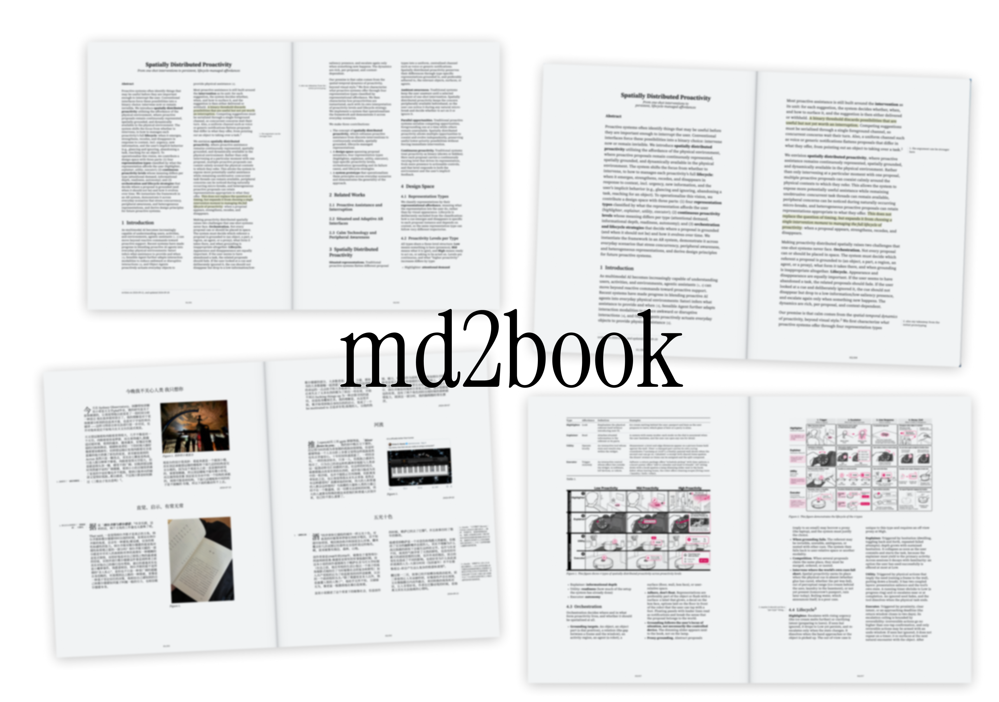

<p align="right"><a href="README.zh-CN.md">中文</a> · <b>English</b></p>

# md2book

"Share your Markdown notes the way you'd hand a friend a book."



Markdown has become a good medium for talking with agents. I made this tool to share Markdown just as well with your human friends: when you present what you share with care, it is listened to with care, and you may get feedback that matters to you and start conversations that open minds.

## Which way is for you

| You want to… | Do this | You need |
|---|---|---|
| Read your own notes as a book | [Open the website](#read-in-your-browser) | Chrome or Edge |
| Have your own copy of that website | [Host the website yourself](#host-your-own-copy-of-the-website) | A GitHub or Vercel account |
| Preview your notes while you write | [Run it on your computer](#run-it-on-your-computer) | Node.js 20.12 or later |
| Share your notes with friends online | [Publish your notes](#publish-your-notes-online) | Node.js and a Vercel account |

> The website reads notes from the computer of whoever opens it. To let friends read *your* notes, publish them (the last row).

No apps, plugins or exports needed.

## Features

- One note or many in sequence, in two-column or single-column pages that turn like paper.
- Collections of notes, organized by folders or by tags.
- Each collection can use one of two layouts: **paper** (each note starts on a fresh page, modeled on academic papers; good for research notes) and **zine** (notes run on one after another; good for essays and journals).
- Beyond standard Markdown, [Obsidian](https://obsidian.md) syntax is supported too: `[[wikilink]]`, `![[embedded image]]`, math.
- [CriticMarkup](https://criticmarkup.com) edits (rendered as the final copy) and comments (shown as margin notes).
   - Want a nice way to write CriticMarkup in Obsidian? Try the plugin [Simple Commentor](https://github.com/ziru-wei/obsidian-criticmarkup/tree/ziru-custom).
- Citations: links become numbered references.
- Figures, tables and headings are numbered automatically; figures and tables can span both columns.
- Justified text, per collection: each paragraph broken as a whole, with even spacing and English hyphenation (set by [Justif](https://github.com/lyallcooper/justif)).
- Paper you can feel, each effect on its own switch with a strength slider (settings → Layout → Paper): **show-through**, the page on the back faintly visible, mirrored, as in a printed book; and **letterpress**, letters with slightly uneven edges and a faint impression, as if pressed into the paper.
- Desktop, phone and tablet layouts; pinch to zoom.
- Print from the browser to a clean PDF.

## Read in your browser

1. Open **<https://ziru-wei.github.io/md2book/>** in Chrome or Edge, and choose English or 中文 (switch later at the top right, or in settings: the two follow each other).
2. Click **Choose a note repo…** and choose your notes folder. An Obsidian vault works as it is.
3. When the browser asks whether the site may view your files, allow it.

That's it. Your notes appear as a book, and the pages update as you edit. Next time, the site opens the same folder again (the browser may ask once more; choose **Allow on every visit** so it won't).

- **Your notes stay on your computer.** The browser reads them; nothing is uploaded.
- **Settings**: on the home page, click **Settings** at the top right. They're saved in this browser, for each folder. If your folder has an `md2book.settings.json` at its top level, it's used until you change something.
- **Another note repo**: on the home page, click **Note repo** at the top right.
- **Firefox and Safari** read the folder once, as it is when you pick it; open it again to see changes. Phones aren't supported.

## Host your own copy of the website

Your own address, and a copy whose look you can change (`static/book.css`). It works just like the one above: each reader opens a folder on their own computer.

### On GitHub Pages

1. [Fork this repository](https://github.com/ziru-wei/md2book/fork).
2. In your fork, go to **Settings → Pages**, and under **Build and deployment → Source** choose **GitHub Actions**.
3. Go to the **Actions** tab and enable workflows. Pick **Browser reader on GitHub Pages**, click **Run workflow** and run it.

A minute later your site is at `https://<your-username>.github.io/md2book/`. Every push to `main` updates it; to get later md2book updates, click **Sync fork** on your fork's page.

### On Vercel

```bash
git clone https://github.com/ziru-wei/md2book.git md2book-web
cd md2book-web
npm install
npm run build:web
npx vercel deploy dist --prod
```

Vercel asks a few questions the first time; press Enter for each. The URL it prints at the end is your site. To update it later, run the last two commands again.

Deploy the `dist` folder, not the whole repository: the repository's own `vercel.json` sets up the note-publishing server described below.

### Anywhere else

Any static host works (Netlify, Cloudflare Pages…): build command `npm run build:web`, output directory `dist`.

## Run it on your computer

Requires Node.js 20.12 or later. The first time:

```bash
git clone https://github.com/ziru-wei/md2book.git
cd md2book
npm install
node bin/md2book.js path/to/your/notes
```

Every time after that (replace the path with your notes folder):

```bash
cd md2book
node bin/md2book.js path/to/your/notes
```

Your browser opens `http://localhost:3000`, and the page reloads when your notes change. Press `Ctrl+C` to stop.

### Settings

```bash
cd md2book
node bin/md2book.js settings path/to/your/notes
```

The settings page opens in your browser. Changes are saved right away to `md2book.settings.json` in the md2book folder (kept out of git), which is uploaded with the code when you deploy. Press `Ctrl+C` when you're done.

Layout is set per collection: the "All" row applies to every collection, and you can add a row for any one collection. A note opened on its own follows its collection's layout; if it's in several collections laid out differently, it uses the "All" row, unless one of them has "Apply to all" ticked.

## Publish your notes online

This puts your notes themselves on the web, for anyone with the link. It uses Vercel; the first time, install it and log in:

```bash
npm install -g vercel
vercel login
```

> Don't want others browsing the list of all your notes? In settings, set "Site → Home page path" to something no one can guess, such as `/a1b2c3`.

### Option 1: notes in a local folder

**First deployment**

```bash
cd md2book
rsync -a --delete --exclude '.*' path/to/your/notes/ notes/
vercel deploy --prod
```

Vercel asks a few questions the first time; press Enter for each. The URL it prints at the end is your site.

**After your notes change**

```bash
cd md2book
rsync -a --delete --exclude '.*' path/to/your/notes/ notes/
vercel deploy --prod
```

**Changing settings**

Edit:

```bash
cd md2book
node bin/md2book.js settings path/to/your/notes
```
Make your changes on the settings page that opens, then press `Ctrl+C`.

It saves your settings to `md2book.settings.json` in the md2book folder, so you can also edit that file directly.

Upload your changes:

```bash
vercel deploy --prod
```

### Option 2: notes in a GitHub repository

**First deployment**

1. Create a read-only token: open <https://github.com/settings/personal-access-tokens/new>, pick your notes repository under Repository access, set Contents to Read-only under Permissions, generate it and copy it.
2. In a terminal (each command asks you to paste its value):

```bash
cd md2book
vercel link
vercel env add GITHUB_OWNER production    # your GitHub username
vercel env add GITHUB_REPO production     # your notes repository's name
vercel env add GITHUB_TOKEN production    # the token from step 1
vercel deploy --prod
```

Optional: if your notes aren't on the `main` branch, add `vercel env add GITHUB_BRANCH production`; to publish only some top-level folders, add `vercel env add GITHUB_DIRS production` (comma-separated, e.g. `Journal,Research`). Then run `vercel deploy --prod` again.

**After your notes change**

Push your notes to GitHub as usual. The site reads the latest content; no redeploy needed.

**Changing settings**

Run it on the copy of your notes repository on your computer:

```bash
cd md2book
node bin/md2book.js settings ~/my-notes-repo
```

Make your changes on the settings page that opens, press `Ctrl+C`, then:

```bash
vercel deploy --prod
```

## Writing and reading
### Your notes

All of these fields are optional extras:

```md
---
created: 2026-04-02
updated: 2026-04-05
publishTag: [japan, trips]
publishID: awesome-trip
publish: true
---

# Kyoto in Spring

The first `# heading` becomes the title; without a level-1 heading, the note's file name is used. The characters that split a title and subtitle can be set in settings.

```
- **Dates**: `created`/`updated` appear as a small byline and set the order of notes in a collection, oldest first. Without them, local notes use the file's own creation and modification dates.
- **Drawings**: Excalidraw drawings (`*.excalidraw.md`) and canvas files are skipped.
- **Hiding a note**: write `publish: false` in its YAML front matter.
- **Links that don't break**: a note's URL comes from its file path by default, so renaming or moving the file changes the link. Give the note `publishID: any-value` and the link stays fixed wherever the file moves in your vault.


#### Collections

`http://localhost:3000` lists every note; the search box at the top searches titles and text. Press **Space** on this page to pick a collection. A note belongs to these collections:

- its top-level folder, however deep in subfolders it sits (e.g. `travel/japan/kyoto.md` is in the `travel` collection);
- each tag in its front matter's `publishTag` field.

In settings you can choose which folders count (subfolders too), use other or additional front matter fields and limit which of their tags count, and whether `#tags` in the text count.

Each collection lives at `/contents/<collection name>`.

#### Writing syntax

- Regular Markdown.
- `[text](https://…)` shows as "text [1]", with the source listed in references at the end; the same link repeated shares one number.
- `{==REF==}{>>https://…<<}` renders the source as a bare citation mark `[1]`; several in a row, like `({==REF==}{>>…<<}, {==REF==}{>>…<<})`, merge into `[1, 2]`.
- `[[another note]]`, `[[another note|display text]]` and `[text](another-note.md)` all link to other notes; a link to a note that is unpublished or doesn't exist opens a "This note isn't available now" page.
- Math: `$…$` inline, `$$…$$` for a display block.
- CriticMarkup renders only the final result: `{--deleted--}` is hidden, `{++added++}` is kept, `{~~old~>new~~}` shows only "new", and `{==text==}` shows as "text". A comment right after a substitution or highlight, like `{==text==}{>>comment<<}`, becomes a numbered margin note lined up with the line it marks; headings can carry comments too.
- Headings are numbered automatically (1, 1.1…); if the first heading is "Abstract", it isn't numbered.

#### Images and tables

`![[image.png]]` finds the image by file name anywhere in your vault, as Obsidian does; `` (relative to the current note) and hosted image links work too.

Mark lines under an image with `//` to add a caption, make it a teaser (header image) or a span (across both columns), or set its width as a percentage of the full text width (e.g. `//40`; without it, the default width — in two columns, and on phones, a column is about half as wide, so `//40` is 80% of it and 50 or more fills it). The marks can go in any order. The caption starts at the image's left edge and wraps at its right edge.

```md
![[kyoto.jpg]]
//The Philosopher's Path in April.
//teaser

![[kyoto.jpg]]
//teaser
//The Philosopher's Path in April.
//40

![[kyoto.jpg]]
//teaser

![[kyoto.jpg]]
//span

```


### Reading controls

| Action | Desktop | Touch |
|---|---|---|
| Turn the page | ←/→, A/D, or swipe left/right on the trackpad | Swipe |
| Single / two-page view | `/` | Rotate the device |
| Larger-text "tablet" pages | `\` | — |
| Contents (collection) or outline (single note) | Space | — |

## How it works

`lib/render.js` turns each note into HTML (on the server, or in your browser for the browser version); in the browser, `static/reader.js` cuts the content into pages. Each page's body is a two-column box exactly as tall as the space left on that page, and whatever the browser can't fit, overflowing into a third column, becomes the start of the next page. Column and page breaks are left entirely to the browser's own layout engine instead of a separate simulation. Pages are laid out at a fixed size, then scaled as a whole to fit the screen. P.S. WebKit and Paged.js have bugs with nested multi-column layout, so in keeping with this project's purpose, sharing, and so readers can browse on any platform, I dropped Paged.js and reinvented a few wheels.

## Acknowledgements

Justified text is set by [Justif](https://github.com/lyallcooper/justif) (© Lyall Cooper, [MIT License](https://github.com/lyallcooper/justif/blob/main/LICENSE)), installed unmodified as an npm dependency; the site serves its license at `/vendor/justif/LICENSE`. English hyphenation uses the patterns by Donald E. Knuth and Frank M. Liang from TeX's hyphen.tex.
